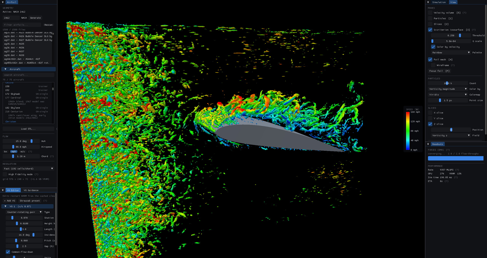

# FoilCFD

**A real-time GPU wind tunnel for people who build airplanes — or are just fascinated by what makes them fly.**

[](LICENSE)
[](#requirements)
[](#requirements)



Load your airfoil. Set your angle of attack. Watch a million particles stream over the wing
in real time. Bolt on vortex generators, drag a slider, and see the separation bubble react
*right now* — not after an overnight mesh-and-solve marathon.

FoilCFD is a CUDA lattice-Boltzmann solver (D3Q19, TRT, Smagorinsky LES) strapped to an
interactive 3D visualizer. On an RTX 5090 it pushes **~8 billion lattice updates per second**
on a 23.6M-cell grid — about 340 full solver steps every second, while rendering. That's not
"fast for CFD." That's a wind tunnel with a framerate.

And it's a wind tunnel with a **wall-modeled boundary layer**. To our knowledge, FoilCFD is
the only publicly available solver that runs wall-modeled LBM-LES in real time on a consumer
GPU — the technique that lets the simulation carry flight-Reynolds wall physics instead of
separating a quarter-chord too early. The wall-modeled heavyweights run on clusters,
overnight. The real-time GPU codes skip the wall model. This one does both at once —
[details below](#the-wall-model-why-this-one-is-different).

### Sim time vs. wall time

One lattice step advances physical time by `dt = u_lat × dx / airspeed` (derived in
`src/sim/units.h`, the single unit-conversion authority). At the default setup — 1.2 m
chord, 30 m/s airspeed, 256 cells/chord, lattice speed 0.08 — that's dt ≈ 12.5 µs, so
**~80,000 solver steps equal one real-world second of flow**. The general formula:

```
steps per real second = airspeed [m/s] × cells_per_chord / (u_lat × chord [m])
```

At ~340 steps/s on an RTX 5090, the tunnel runs at roughly **1/235 of real time** — one
second of physical flow takes about four minutes of wall clock at the default grid. The
app itself doesn't slow down to match: per-frame solver work is capped at 10 ms (TDR
safety), so the visualizer stays at interactive framerates (typically **60+ FPS**,
render-bound), advancing ~5–6 solver steps per rendered frame. Faster airspeeds and
finer grids both shrink dt, so the steps-per-real-second count grows linearly with each.

*(Screenshots: clean vs. VG'd wing comparison pair coming with milestone M4 —
`screenshots/m4_clean.png` / `screenshots/m4_vg.png`)*

---

## Who this is for

You're building a Glasair, a Lancair, an RV — something with your name on the data plate —
and you're staring at a bag of vortex generators wondering *where exactly do these go?*

FoilCFD gives you a defensible **starting point**: chordwise station, height, spacing, and
incidence, grounded in your actual airfoil at your actual angle of attack, guided by
published correlations (Lin 2002, flight-proven recipes — see [docs/CITATIONS.md](docs/CITATIONS.md)).
Run the clean wing, save the converged state, drop a VG array, and compare. The delta is
the product.

Then go tuft-test it. Cotton tape is cheap. Trust, but verify — this tool exists to make
your first guess a *good* guess, not to replace the roll of tape.

Not drilling holes in anything yet? It's still mostly about airplanes — but the tunnel
doesn't check your pilot's license. Any watertight STL flies here (see
[Custom STL import](#custom-stl-import)): drones, fairings, whatever you're curious about.

## The wall model (why this one is different)

Here's the dirty secret of fast CFD: at flight Reynolds numbers the viscous sublayer of a
boundary layer is a fraction of a millimeter thick. No interactive grid on Earth resolves
it — so fast solvers historically just... didn't. Under-resolved walls under-predict skin
friction, the boundary layer runs out of momentum too soon, and the flow **separates too
early**. For a tool whose entire job is "where does the flow separate and what do VGs do
about it," that's not a rounding error. That's lying about the headline.

FoilCFD closes that gap with an **iMEM slip-velocity wall function** (Asmuth et al. 2021;
see [docs/CITATIONS.md](docs/CITATIONS.md)): every surface cell continuously solves the
Reichardt law of the wall for its local friction velocity and prescribes exactly the wall
shear stress a real turbulent boundary layer would exert — on the stair-step voxel surface,
on every grid level of the refinement patch, with the modeled stress carried into the Cl/Cd
readouts. The 45° stair facets get true 45° normals. VG vanes keep exact no-slip walls (a
vortex generator's job is to BE an obstacle) — and get their *own* sub-cell surface
treatment so the slanted edge isn't a staircase (see
[Sub-cell vane surfaces](#sub-cell-vane-surfaces-the-vgs-get-special-treatment)). The Sim
panel shows the live y+ telemetry so you always know what the model is doing.

**As far as we can tell, nothing else publicly available does this in real time** — wall-
modeled LBM-LES exists in cluster-class commercial codes (overnight turnaround, five-figure
seats) and in research papers; real-time GPU LBM codes run plain bounce-back walls. FoilCFD
runs the wall model live, on one consumer GPU, in a tool that's free for noncommercial use.
First polar check on the LS(1)-0413 (Glasair III section): wall-modeled CL_max landed
between the NASA wind-tunnel curves bracketing the target Reynolds number — exactly where
an honest simulation should sit — with no premature separation. The validation polar tool
(`polar_ls413`) reproduces this; full numbers in [validation/](validation/).

The model knows its limits, and enforces them: below y+ ≈ 3 (sublayer genuinely resolved)
it fades itself out and hands the wall back to plain bounce-back; at stagnation and inside
separated zones (no meaningful tangential flow) it steps aside automatically; and a safety
clamp plus live "clamped cells" telemetry tells you if it's ever fighting the resolved flow
instead of helping it. Auto mode turns it on only when the grid actually can't resolve the
sublayer.

## The honesty section

Read this before you drill holes in your wing:

- **Trust deltas, not absolutes.** VG-on vs. VG-off on the identical grid is meaningful.
  An absolute Cl at flight Reynolds number is not a certification value.
- **Effective Reynolds number is displayed, always.** Your wing flies at Re ~2-6 million;
  the outer flow runs at the highest stable effective Re it can (typically 1e4–1e5 at
  default resolution) and tells you both numbers. The wall model closes the wall-physics
  half of that gap — the surface now exerts flight-Re turbulent stress — but transition
  and outer-flow turbulence content still belong to the effective Re.
- **The wall function is an equilibrium model.** It assumes an attached, mildly-loaded
  turbulent profile — which makes it slightly attachment-happy right at incipient stall
  (a known property of every equilibrium wall function ever shipped). Absolute CL_max
  reads a touch optimistic; VG-on/VG-off deltas share the bias and cancel it.
- **High Fidelity mode** trades interactivity for accuracy: finer grids (Fine/Ultra
  presets), lower lattice Mach, force averaging over many flow-throughs. Dual-resolution
  Richardson trend extrapolation with an error bar on deltas is on the v1.x roadmap.
- **The foil is stair-stepped voxels** with half-way bounce-back — now wall-modeled (see
  above), so the stress on it is honest even when the geometry is chunky. The VG vanes go
  further and get sub-cell-accurate surfaces (q-LIBB), so the one place a sharp slanted edge
  matters most isn't a staircase.
- Forces are gated until the flow has actually developed (two flow-throughs minimum) —
  the readout refuses to lie to you while the tunnel is still spinning up.

## 60-second quickstart

```powershell
git clone <this-repo> foil_cfd
cd foil_cfd
cmake -B build -G "Visual Studio 17 2022" -A x64 -T cuda=12.9
cmake --build build --config Release
.\build\Release\FoilCFD.exe
```

Exact build details and troubleshooting: [BUILDING.md](BUILDING.md).

1. Pick an airfoil — NACA 4-digit text box, or any of the **1,587 UIUC database foils**
   shipped in `airfoils/uiuc/`, or search your *aircraft* by name in the Aircraft menu
   (Glasair III → LS(1)-0413, like magic).
2. Set AoA and airspeed. The flow starts immediately.
3. Press `1` for the particle view. Find where the flow separates.
4. Save the clean state (one click — it's cached in VRAM and on disk).
5. Add VGs in the VG editor. The sim warm-restarts from the clean state in seconds —
   it never recomputes the whole wing from scratch.
6. Compare Cl/Cd/L-over-D deltas and the separation line. Iterate.

## Airfoils in, three ways

- **NACA generator** — type "2412", get a wing section.
- **UIUC database** — the full coordinate database is committed in `airfoils/uiuc/`
  (refresh it anytime: `python scripts/fetch_uiuc_airfoils.py`). Drop your own `.dat`
  files (Selig or Lednicer format) into `airfoils/` — the loader is defensive about the
  database's, let's say, *artisanal* formatting, and tells you exactly why a file was
  rejected if it can't be parsed.
- **Aircraft manifest** — `airfoils/aircraft_manifest.csv` maps popular aircraft
  (homebuilts first) to their sections, sourced from Lednicer's *Incomplete Guide to
  Airfoil Usage*. Searchable in-app. User-editable CSV — add your own bird.

## Vortex generators

Parametric VG types: single vane, counter-rotating pairs, co-rotating arrays, ramps.
Place by chordwise station; height, length, incidence, pitch, and gap are all live
parameters. The vane root follows the actual airfoil surface.

The **guidance panel** shows the simulated boundary-layer thickness (δ99) at your selected
station and the published recommended ranges: VG height 0.1–1.0 δ99 (low-profile sweet spot
0.2–0.5), placement 5–10 vane-heights upstream of separation onset (Lin 2002), with a
one-click flight-proven preset (x/c ≈ 0.07, ±15° counter-rotating, l = 3h — Strausak 2021).
If your VG is under-resolved on the current grid, the UI says so instead of rendering noise —
and the Mesh panel can **auto-raise the patch factor** until every vane clears its minimum
resolved height.

Then the **vortex strength audit** checks the result like a skeptical wind-tunnel tech: it
integrates the streamwise circulation actually shed by your vanes from a crossflow plane
behind the row, subtracts the ambient-vorticity floor, and compares it against the Wendt
correlation (NASA/CR-2001-211144) evaluated at your *live* local edge velocity and
boundary-layer thickness. Green means the voxelized vane sheds what real hardware sheds and
the placement deltas are worth believing; red means buy more resolution before trusting the
number. No other VG tool tells you when it's guessing. This one does.

### Sub-cell vane surfaces (the VGs get special treatment)

A vortex generator is a thin slanted plate, and the whole point of it is the vortex its
*edge* sheds. But a uniform lattice wants to chop that slanted edge into a Lego staircase —
every cell is all-solid or all-fluid, so a 16°-yawed vane becomes a flight of voxel steps,
and the shed vortex inherits the staircase. Throwing more cells at it (the
[nested 4× patch](#mesh-refinement-nested-grids) below) makes the steps smaller but never
makes them go away.

So FoilCFD does something better, *only* for the vanes: **interpolated bounce-back**
(q-LIBB, Bouzidi–Firdaouss–Lallemand 2001). When voxelizing a vane we keep its true analytic
side-plane, and for every lattice link that crosses it we store the exact fraction `q ∈ [0,1]`
of where the real surface cuts the link — then place the bounced-back wall at *that* sub-cell
position instead of snapping it to the cell boundary. It's the fluid-dynamics version of the
sub-pixel trick a font renderer uses to make smooth diagonals on a square pixel grid: the
grid doesn't get finer, the *edge* just stops lying about where it is. The result is a
second-order-accurate slanted wall on the same cells — a crisp vane face where there used to
be a staircase.

The details that make it safe to ship: it runs on the levels where vanes are actually
resolved (the fine and nested patches), the solver's TRT magic parameter (Λ = 3/16) pins the
wall location independent of viscosity, the moving-wall slip term of the
[wall model](#the-wall-model-why-this-one-is-different) composes on top unchanged, and a vane
too thin to have a fluid neighbour on both sides of a link falls back to plain bounce-back on
that link rather than guessing. The Mesh panel reports how many vane links it sub-cell
resolved. Toggle it with **"Sub-cell vane surfaces (q-LIBB)"**; on by default.

## Custom STL import

Drag a watertight STL onto the window. You get axis remap, scaling to a chosen chord, GPU
ray-parity voxelization, and the same force readouts. Caveats (by design, v1):

- Non-watertight meshes produce garbage; FoilCFD detects bad parity and warns instead of
  pretending. Fix your mesh.
- No parametric surface means no automatic VG surface placement — you get a free 3D
  placement gizmo instead.
- Spanwise-periodic boundaries may be wrong for a full 3D body; there's a toggle to switch
  the z-boundaries to free-slip walls in STL mode.
- Triangle cap: 2M.

## Mesh refinement (nested grids)

The LBM lattice is intrinsically uniform — you can't stretch it without changing the
physics it solves. So FoilCFD refines the honest way: a **2–4× finer nested lattice patch**
covering the leading edge, suction-surface boundary layer, VG zone, and near wake, two-way
coupled to the base grid every step (the multi-level scheme of the Filippova–Hänel /
Dupuis–Chopard family).

**How it works:** at factor m the fine level runs m sub-steps of `dt/m` per coarse step at
1/m the cell size, with the same physical viscosity (`tau_f = m·(tau_c − ½) + ½`). At the
patch boundary a two-cell interface shell receives trilinearly-interpolated populations
from the coarse grid (time-blended between coarse steps), with the non-equilibrium part
rescaled to the fine level so the strain rate — and therefore the stress — carries across
the interface correctly. After its sub-steps the fine solution is restricted (averaged,
inverse-rescaled, and blended over a few-cell ramp at the patch edge so no spurious vortex
sheet forms at the hand-off) back onto the coarse grid. The fused collision kernel itself
is untouched: it runs identically on every level.

**The interface, kept clean:** a resolution jump is an aliasing trap — under-resolved
high-wavenumber content dumps energy into the lattice's non-hydrodynamic "ghost" modes and
radiates a grid-aligned haze of spurious vortices off the patch faces (Astoul et al. 2020).
FoilCFD suppresses it at the source: the populations crossing the interface are
**regularized** — projected onto the physical stress tensor (Latt–Chopard) so only the
hydrodynamic part carries across — and the restriction **filters** the non-equilibrium part
over its lattice neighbours (Lagrava et al. 2012). Together they keep the hand-off seamless
enough that a third level can stand on top of it.

**A third level, just for the VGs:** because the kernels are level-agnostic, the fine patch
itself hosts an even finer **nested box hugging only the vortex generators**, running at 2×
the fine factor (so 4× the coarse grid with the default 2× patch). The vanes shed their
vortices at the finest resolution in the solver while the rest of the foil stays at 2× — far
cheaper than refining the whole wing to 4×, since the box is tiny. It builds automatically
when VGs are present and tears itself down gracefully (and silently falls back to 2×-only) if
it can't fit. Toggle it with **"Finer VG patch (4×)"** in the Mesh panel.

**What you get:**
- **m× wall resolution** on the foil, the VG vanes, and the boundary layer the VG guidance
  reads — a vane that voxelized at 8 cells gets 16 at 2× or 32 at 4×.
- **Forces measured on the fine grid** whenever the patch covers every solid cell (the Mesh
  panel shows which grid the momentum exchange ran on).
- Honesty note: the effective Reynolds number is **shared across levels** — the patch buys
  resolution at the same Re, not a higher Re. The inner boundary layer is handled by the
  [wall model](#the-wall-model-why-this-one-is-different), which runs on both levels and
  rebuilds itself automatically whenever the patch or the geometry changes.

The **Mesh** panel (tabbed with Sim/View) has the resolution selector (Off/2×/3×/4×), four
margin sliders (upstream/wake/above/below, in chords around the foil+VG bounding box), a
live diagram plus an in-scene bounding-box overlay of the patch, and the VRAM bill. Compute
grows ~m⁴ and VRAM ~m³ — 2× is the sweet spot; at the Default preset it adds roughly 6 GB.
If the allocation fails the sim simply continues on the base grid and tells you.

**Voxel view** (View panel, under Foil mesh): swaps the smooth outline for the solver's
actual stair-step voxelization — coarse cubes outside the patch, 1/m-size cubes inside.
The definitive way to judge whether a VG vane is adequately resolved before trusting its
delta.

## Clean startups (no impulsive shock)

A fresh run can't just teleport the air to full speed past a stationary wing — that leaves a
moving fluid against a flat pressure field, which isn't a valid flow state, so the first
collisions fire off an acoustic pressure shock that rings off the leading and trailing edges
(and, on a tau-clamped grid, can take the patch with it). Real wind tunnels spin up; so does
this one. Every cold start (geometry, AoA, airspeed, VG edits) **initializes the field at
rest and ramps the inlet velocity up to speed** with a smooth easing, alongside the existing
startup viscosity ramp. The pressure field develops around the body instead of slamming into
it — no shock, no startup artifacts, and in the velocity view the flow visibly fades in as it
accelerates. The force readouts stay gated until the flow has developed regardless.

## How it works (one paragraph)

FoilCFD solves the lattice-Boltzmann equation on a D3Q19 lattice: every cell holds 19
particle-population values that stream to neighbors and collide each step, and the
macroscopic flow (density, velocity, forces) emerges from their moments. Collisions use a
two-relaxation-time (TRT) operator for clean wall behavior, plus a Smagorinsky subgrid model
computed locally from the non-equilibrium populations so the unresolvable turbulent scales
dissipate physically instead of blowing up. The whole update is one fused CUDA kernel — LBM
is embarrassingly parallel and memory-bound, which is why a consumer GPU does in
milliseconds what a CPU RANS solve does in hours. The memory-layout and precision tricks
follow Lehmann's work on GPU-LBM (Esoteric Pull, mixed-precision storage — see
[docs/CITATIONS.md](docs/CITATIONS.md)).

## Requirements

- Windows 10/11, NVIDIA GPU (Ampere or newer recommended; ~5 GB VRAM at default grid)
- CUDA Toolkit 12.8+ (12.9 tested), Visual Studio 2022, CMake 3.24+
- **Big grids + slow GPUs:** Windows will kill any kernel that hogs the display GPU for ~2 s
  (TDR). FoilCFD caps per-frame solver work to stay under it, but if you push Fine/Ultra
  presets on a smaller card, raise `TdrDelay` in
  `HKLM\SYSTEM\CurrentControlSet\Control\GraphicsDrivers` (REG_DWORD, seconds, reboot).

## Validation

The solver isn't taken on faith: the CTest suite runs Taylor–Green decay (M0), lid-driven
cavity vs. Ghia et al. reference profiles (M1), cylinder vortex shedding vs. the canonical
Strouhal band (M2), two-level refinement coupling (M3), and the nested three-level coupling
(a solid-free freestream stays uniform to round-off through both interfaces) on the GPU, plus
parser/units/voxelizer/wall-list/audit-math and q-LIBB cut-fraction geometry unit tests.

The wall model gets its own gauntlet: **M4** plants a synthetic Reichardt boundary layer
with a known friction velocity and demands the model read it back (recovered within 8%),
hold it in equilibrium without ringing, and step aside completely at resolved-sublayer
Reynolds numbers (ON vs. OFF force delta: 0.10%). **M5** runs the full pipeline on a real
airfoil: VG rows measurably re-attach the aft suction surface, shed circulation rises with
patch resolution, and the audit's measurement infrastructure holds under every toggle.

Measured results live in [notes/VALIDATION.md](notes/VALIDATION.md). Solver-QA anchors
(digitized NASA lift curves for the LS(1)-0413 family, XFOIL polars) live in
[validation/](validation/README.md), alongside the wall-modeled lift polar from the
`polar_ls413` tool — whose CL_max lands between the bracketing NASA wind-tunnel curves at
the target Reynolds number.

## License

[PolyForm Noncommercial 1.0.0](LICENSE) — source-available, free for any noncommercial use.
Building a plane? Free. Selling CFD seats? Talk to us.
